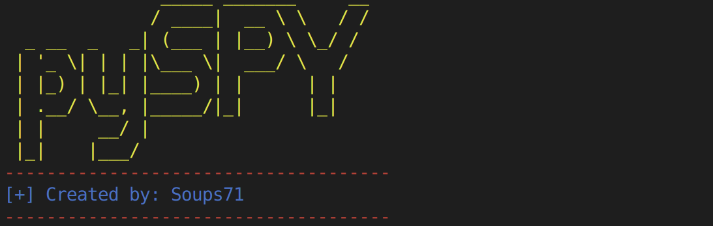

# pySPY 
### Version_2

## Backstory:
So long story short I kinda hate aircrack-ng. Also I want to make a wifi-Kracken. I didn't feel as though aircrack suite had the same usability that I was looking for so I decided to write my own utility in python. For the actual cracking of handshakes aircrack is still needed but this suite acts in place of airodump, airplay.

## Installation


Run the following commands in order for instalation:
```
$ sudo apt install libpcap-dev
$ sudo apt install git
$ git clone https://github.com/Soups71/pySPY.git
$ cd pySPY
$ sudo pip3 install -r requirements.txt

```


## Current offerings
At the moment there are three scripts:
* `apSPY.py`
    * Finds the various AP within radio ear shot
* `deauthenticate.py`
    * Deauthenticates users from the Access point
* `get_handshakes.py`
    * Collects wifi packets


## Access point monitoring
```
usage: apSPY.py [-h] [-i INTERFACE] [-freq FREQUENCY] [-q] [-w WRITE]

optional arguments:
  -h, --help            show this help message and exit
  -i INTERFACE, --interface INTERFACE
                        Specify interface to run attack
  -freq FREQUENCY, --frequency FREQUENCY
                        Specify frequency to run attack: 2 for 2.4 ghz or 5 for 5 ghz
  -q, --quiet           Suppresses normal output of the program
  -w WRITE, --write WRITE
                        Saves AP data to file
```

## Deauthentication 
```
usage: deauthenticate.py [-h] [-i INTERFACE] [-b BSSID] [-dm DESTINATION_MAC] [-freq FREQUENCY] [-f] [-q] [-c CHANNEL]

optional arguments:
  -h, --help            show this help message and exit
  -i INTERFACE, --interface INTERFACE
                        Specify interface to run attack
  -b BSSID, --BSSID BSSID
                        MAC address of the AP you want to target
  -dm DESTINATION_MAC, --dest_mac DESTINATION_MAC
                        Destination MAC address. Needed to deauth specific device
  -freq FREQUENCY, --frequency FREQUENCY
                        Specify frequency to run attack: 2 for 2.4 ghz or 5 for 5 ghz
  -f, --forever         Sets the duration of the deauth attack
  -q, --quiet           Suppresses normal output of the program
  -c CHANNEL, --channel CHANNEL
                        Specific channels you'd like to scan. Format: -c 1
```

## Collect Wireless handshakes
```
usage: get_handshakes.py [-h] [-c CHANNEL] [-e] [-a] [-freq FREQUENCY] [-q]

optional arguments:
  -h, --help            show this help message and exit
  -c CHANNEL, --channel CHANNEL
                        Specific channels you'd like to scan. 2.4 or 5 GHz Format: -c 1,2,3,4
  -e, --eapol           Used to display number of all captured packets. This is slower than the -a option!!!
  -a, --all             Capture all the packets that you can as fast as you can.
  -freq FREQUENCY, --frequency FREQUENCY
                        Specify frequency to run attack: 2 for 2.4 ghz or 5 for 5 ghz
  -q, --quiet           Suppresses normal output of the program
```

## ALFA Wireless Card Drivers:

Throughout the development of this project I have had numorous problems with install wireless drivers for ALFA wireless cards. As a result, I'm providing the resouces that I utilized. There is no guarentee that this will work but it is at least a start. THIS IS NOT MY PROJECT OR ASSOCIATED WITH PYSPY AT ALL!!!

[ALFA WIRELESS CARD DRIVERS](https://askubuntu.com/questions/1042310/install-driver-rtl8814au-on-ubuntu-18-04)

## Updates:
Version 2 has a lot of changes mainly focused on easier use. In addition to this version 2 implements `pylibpcap` instead of `Scapy` to capture packets in `get_handshakes.py` in order to prevent the dropping of packets. Not 100% its the best solution but it seems to work better now than it used to.

## Disclaimer:
This project is for education and learning. Do NOT use it to attack any networks you do not have explicit permission to test on. I take no responsibility for how you choose to use this. Please consult local laws as to determine the legality of preforming deauthentication attacks and packet sniffing.

Created by: Soups71

